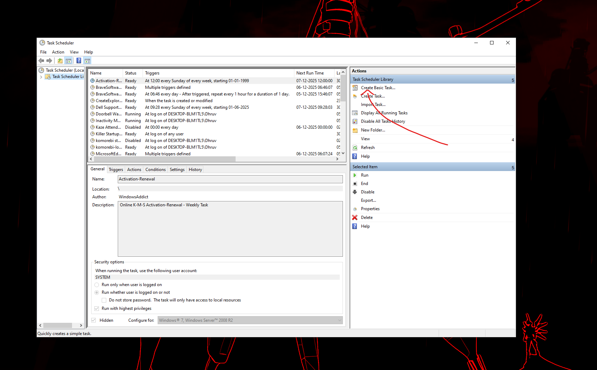
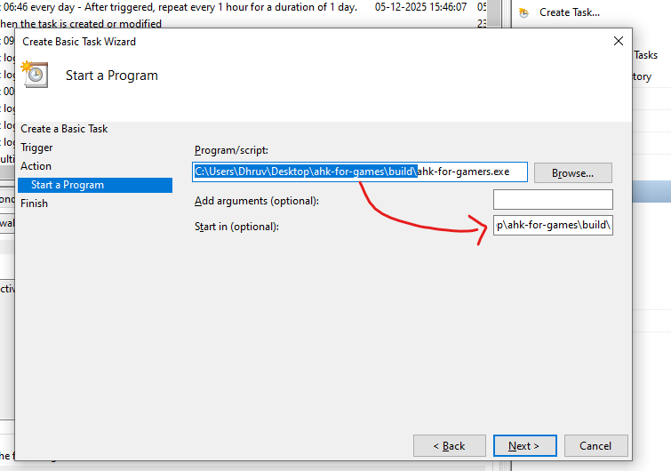

# AHK for Gamers

<p align="center">
  
</p>

## Automatically stops AutoHotkey scripts when certain games or anti-cheat software are running, and restarts them when you're done playing

It is unfortunate that I have to resort to this in order to play my favourite games.

## How to use

For most folks, install a pre-build here:

[Link]: https://github.com/SuppliedOrange/AHKForGamers/releases/latest 'Latest Release'
[Button Icon]: https://img.shields.io/badge/Releases-EF2D5E?style=for-the-badge&logoColor=white&logo=DocuSign
[![Button Icon]][Link]

Once you install the folder, all you need to do is run the executable. However, if your system has a weak CPU or
your CPU is often used by other software, you will want to change the `process_query_poll_wait_seconds` value through
the config option of the system tray icon to something a bit higher (like 0.3 or 0.4). Then restart to see if your
system has better CPU performance with this app while also being able to react faster than the game's anticheat.

It's an integral part of this app because the lower the number = the faster the game detection = lower the risk of
the game picking it up before you.

The app will automatically:

+ Pick up any ahk scripts that are running + will run in the future
+ Automatically kill the scripts when you launch an unsupported game
+ Re-launch them when the game/anticheat closes

You can always enable/disable this script or manually hide/restore AHK scripts through the system tray icon!

If you have any issues, please open a ticket here:
[https://github.com/SuppliedOrange/AHKForGamers/issues](https://github.com/SuppliedOrange/AHKForGamers/issues)

## How to make this start up on PC launch

You will need to use the `Windows Task Scheduler` for this. This script does not put itself into the task scheduler
automatically to be less of a pest.

1. Open up Task Scheduler through your search menu.

2. Click on "Create Basic Task"

    ;

3. Name it whatever you want, or "AHKForGamers"

4. Select "When I log on"

5. Select "Start a program"

6. For the program/script part, click on Browse and find the .exe in the folder you downloaded from the releases tab.

7. Modify the "Start in (optional)" field with the base folder of the executable. Look at this for example:

    

8. That's it- but if you're on a laptop it might help to right-click the task you just created from the list select "properties", navigate to "conditions" and uncheck "Start task only if the computer is on AC power" and the one under it.

9. If you move the folder elsewhere later, you'll need to come back, click on properties again and modify the executable path and "Start-in" arguements again.


## Development

- You will need these:

  - **Node.js** v18+
  - Windows WMI enabled
  - **.NET 8 SDK**
  - **Windows** (this is a Windows-only application)

- Clone the repository

- Install dependencies:

   ```powershell
   npm install
   ```

- Build the ProcessWatcher (C# component compiles into a .exe):

   ```powershell
   dotnet restore process_watcher/ProcessWatcher.csproj

   dotnet build process_watcher/ProcessWatcher.csproj -c Release
   ```

- (Optional) Run the app in development mode:

    ```powershell
    npm run tray
    ```

## Building for Distribution

Check pre-requisites in [Development](#development) (above)

Build a standalone executable:

```powershell
npm run build
```

This creates a distributable package in the `build/` folder containing:

+ `ahk-for-gamers.exe` - The main executable

+ `config.json` - Configuration file

+ `game_process_names.txt` - List of games/anti-cheat processes to watch

+ `assets/` - Icon files

+ `process_watcher/` - ProcessWatcher.exe and dependencies

+ `node_modules/better-sqlite3/` - Native database module at Node version 18.5.0 because only this version works or something idk.

### Build Pipeline

The `npm run build` command runs the following steps automatically:

1. **build:process-watcher** - Builds the `ProcessWatcher.exe` dependency

2. **build:bundle** - Bundles TypeScript into a single JS file with esbuild

3. **check:build** - Rebuilds native modules for Node 18 (pkg target)

4. **build:pkg** - Creates the standalone executable with pkg

5. **build:copy-assets** - Copies all required files to build/ folder

6. **check:dev** - Restores native modules for development mode (i.e rebuilds better-sqlite3 at latest version in package.json)

## Scripts Reference

| Command | Description |
|---------|-------------|
| `npm run tray` | Run in development mode |
| `npm run console` | Runs in console without spawning the system tray |
| `npm run build:process-watcher` | Build the ProcessWatcher.exe file |
| `npm run build` | Full build pipeline → `build/` folder |
| `npm run clean` | Remove dist/, bin/, obj/ and build/ folders |
| `npm run check:dev` | Manually rebuild native modules for dev |
| `npm run check:build` | Manually rebuild native modules for pkg |

## Configuration

### config.json

- process_query_poll_wait_seconds: How many seconds to wait before re-polling the process list to see what processes have started/shut down.

### game_process_names.txt

List of process names to watch (one per line). You can find these process names using tools like Process Hacker 2.
When any of these processes start, AHK scripts will be hidden:

```txt
# Games
valorant.exe
# ... etc.

# Anti-cheat
vgc.exe
# ... etc.
```

## Errors

### Native module errors

If you see errors about `NODE_MODULE_VERSION` mismatch for better-sqlite3, run:

```powershell
npm run check:dev
```

### ProcessWatcher.exe not found

Make sure to build the C# component:

```powershell
dotnet build process_watcher/ProcessWatcher.csproj -c Release
```

### Need more help?

Open an issue on this repository, along with your debug logs if possible.
